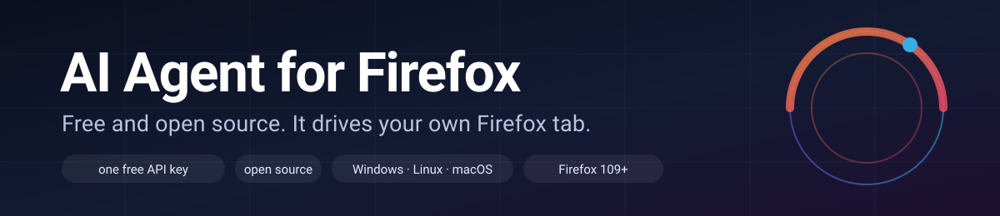

# Jev Ultrafast ⚡

> [!IMPORTANT]
> **The Browser Use Cloud waitlist is open.** Get early access to ultrafast browser agents in the cloud.
> **[Join the waitlist →](https://browser-use.com/ultrafast?utm_source=github&utm_medium=readme&utm_campaign=jev-ultrafast)**

**A browser agent with a dynamic, indexed action space.**

Give it one goal. [TypeSafe's Jev](https://docs.typesafe.ai/introduction) picks an operation and an element. A small LLM writes text only when the operation is `TYPE_TEXT`.

**Zürich → London on Google Flights in 7.1 seconds.** One natural-language goal, actual text generation, and loading waits included.

<a href="docs/demo.mp4"></a>

[Watch the MP4](docs/demo.mp4) · [Measurements](docs/performance.md) · [Read the loop](jev_ultrafast/agent.py)

## The action space

Every observation produces a new element table:

```text
[1] button    Change ticket type · Round trip
[2] combobox  Where from?        · San Francisco
[3] combobox  Where to?          · empty
[4] textbox   Departure          · empty
...
```

The operations are `CLICK`, `TYPE_TEXT`, `SELECT`, `SCROLL_UP`, `SCROLL_DOWN`, `WAIT`, `DONE`, and `BLOCKED`. Only supported operations and targets are offered.

```text
                      one TypeSafe request
                     ┌───────────────────────────┐
page → element table → operation                 │
                     │ click_target              │
                     │ type_text_target          │
                     │ select_target, if present │
                     └─────────────┬─────────────┘
                         use the matching target
                                   │
                    CLICK [7] ─────┤──→ browser
                TYPE_TEXT [3] ─────┘
                          ↓
                   small LLM → text → browser
```

Target questions are speculative. If the operation is `CLICK`, only `click_target` can execute. Two decisions, **one network round trip**. Each target head contains only compatible elements. Native dropdown choices carry an observed element/option index.

There are no site-specific action scripts or prepared field strings in the policy. The Flights example supplies a goal and independently verifies the outcome. The screenshot renderer adds labels afterward; it does not drive the browser.

## Try it

```bash
git clone https://github.com/browser-use/jev-ultrafast.git
cd jev-ultrafast
uv sync
cp .env.example .env
# Add TYPESAFE_API_KEY and TEXT_MODEL_API_KEY.
uv run jev
```

Open **http://127.0.0.1:8766** and click **Start demo → Run automatically**. The inspector shows numbered elements, operation probabilities, target probabilities, and executed actions. **Choose next** pauses before execution.

Chrome connects through [Browser Harness](https://github.com/browser-use/browser-harness), installed by `uv sync`. Run `uv run browser-harness --doctor` if it needs connecting. Allow remote debugging in Chrome when prompted.

`TEXT_MODEL_API_KEY` is an OpenRouter key in the example configuration. The current demo uses `inception/mercury-2.5` with reasoning disabled. Gemini, GLM, and DeepSeek can also use the OpenAI-compatible text helper; configure the appropriate model, endpoint, and reasoning setting.

## Bring your own model

The policy and the text helper are pluggable. If `TYPESAFE_API_KEY` is set, Jev makes the choices. Without it, any OpenAI-compatible or Anthropic-compatible endpoint takes over — OpenRouter, NVIDIA NIM, OmniRoute, OpenAI, Anthropic, DeepSeek, Groq, Together, Mistral, xAI, Gemini, or your own gateway:

```bash
# .env — policy via OpenRouter, text helper via Anthropic
POLICY_PROVIDER=openrouter
OPENROUTER_API_KEY=sk-or-v1-...
POLICY_MODEL=anthropic/claude-sonnet-4.5

TEXT_MODEL_PROVIDER=anthropic
ANTHROPIC_API_KEY=sk-ant-...
TEXT_MODEL=claude-sonnet-4-5
```

Each preset knows its base URL, dialect, and key variable, so `POLICY_PROVIDER=nvidia` plus `NVIDIA_API_KEY` is enough for NIM (`POLICY_BASE_URL` overrides any default, e.g. a remote OmniRoute gateway). The generic policy sends the same indexed element table and rules in one request and validates the returned operation/target against the observed action space, so a wrong or invented choice never executes. Full configuration, including self-hosted gateways and reasoning controls: [providers.md](docs/providers.md). Which parameters each model actually exposes — Kimi's `low/high/max` effort, GLM's thinking toggle, the ones an endpoint rejects at runtime — is discovered, not hardcoded: [model-parameters.md](docs/model-parameters.md).

An optional **planner** role adds a second, slower model that decomposes the mission into a step checklist once, while the fast policy executes one step per turn — two providers at once:

```bash
# .env — executor + text helper on Groq, planner on NVIDIA NIM
POLICY_PROVIDER=groq
GROQ_API_KEY=gsk-...
POLICY_MODEL=openai/gpt-oss-20b

TEXT_MODEL_PROVIDER=groq
TEXT_MODEL=openai/gpt-oss-20b

PLANNER_PROVIDER=nvidia
NVIDIA_API_KEY=nvapi-...
PLANNER_MODEL=z-ai/glm-5.3
```

## Run it fully local (free, offline, potato PCs)

Any local OpenAI-compatible runtime works with **no API key**: Ollama (`POLICY_PROVIDER=ollama`), LM Studio (`lmstudio`), llama.cpp's server (`llamacpp`), or Jan — the model pickers in the sidebar list whatever the running server exposes. Recommended small models for the executor role (September 2026): **Qwen3.5 4B** (~4.5 GB, Apache 2.0, structured output) or **Phi-4-mini** (~2.5 GB, MIT) on CPU; Qwen3.5 9B / 8B class with a GPU or 16 GB+ RAM. A popular hybrid keeps the planner on a free cloud API while the executor and text writer run locally. Full hardware tiers, runtime comparison, setup walkthrough, and speed expectations: **[docs/modelos-locales.md](docs/modelos-locales.md)** (Español).

**The open Jev alternative — [Laya](https://github.com/NandhaKishorM/laya)** (Convai Innovations, Apache 2.0, Sept 2026): an open System-1 decision engine — 32.8 ms calibrated decisions, fully local. The agent uses it, when installed (`pip install -e ".[laya]"`), to route missions and pick skills in **any language**, falling back to keywords on low confidence; it is not yet the browser executor itself (zero-shot choice accuracy and 512-token context are the honest blockers — evaluation and the fine-tuning path in [docs/modelos-locales.md §2](docs/modelos-locales.md)).

```bash
# .env — executor + text on a local Ollama, planner on a free API
POLICY_PROVIDER=ollama
POLICY_MODEL=qwen3.5:4b

TEXT_MODEL_PROVIDER=ollama
TEXT_MODEL=qwen3.5:4b
```

## Run it inside Firefox

`extension/` is a WebExtension that turns this agent into a Firefox sidebar driving your live tab — the same planner/executor loop, the same indexed action space, no Chrome required:

```bash
uv run --env-file .env jev-firefox        # start the local bridge host
# Firefox → about:debugging → Load Temporary Add-on → extension/manifest.json
```

**No terminal?** Double-click `start-host.bat` (Windows), `start-host.command` (macOS), or `start-host.sh` (Linux) — the first run prepares everything and opens the `.env` settings file for your keys. Full point-and-click walkthrough, including how to publish your own copy on GitHub from the web UI: [getting-started-gui.md](docs/getting-started-gui.md). **¿Español? Manual paso a paso súper sencillo: [EMPEZAR-AQUI.md](EMPEZAR-AQUI.md).**

The sidebar shows the plan checklist with ✓ progress, live screenshots, every executed action, and a Stop button. Setup and architecture: [firefox-extension.md](docs/firefox-extension.md).

## Beyond the browser: catalogue, tools, and permissions

The sidebar has grown five more capabilities:

**⚙️ Models & parameters (no `.env` editing), per model.** Open the *Models & parameters* panel: it fetches the live model list from every provider you have a key for (24 h cached registry, `Refresh catalogue` to force it), renders one picker per role — planner, executor, text writer — and derives the *controls from the selected model itself*: the provider dialect decides which parameters can travel (`seed`/`frequency_penalty` on OpenAI-compatible endpoints, not on Anthropic), discovered capabilities decide whether a reasoning control appears at all, family rules offer the values a model documents (Kimi-K: `low/high/max`), an endpoint rejection observed in a real request is remembered in `artifacts/model-runtime.json`, and the **Probe model** button runs one tiny request to record what that model really accepts. Unsupported fields are refused instead of sent, so switching to a leaner model can't leave a stale `reasoning` setting behind. Presets (*Fast / Balanced / Deep / Browser / Coding / Deterministic*) are projected onto the same surface. Selections persist in `artifacts/model-config.json` and override `.env` on the next start (`JEV_MODEL_CONFIG` moves that file). A picker switch re-runs **Test setup** automatically, so a broken model id shows up as 🔴 immediately.

**🛠 Tools & skills.** Missions that need more than the tab don't go through the fast browser loop — they run through an orchestrator (your planner model) with nine tools:

| Tool | What it does |
|---|---|
| `web_search` / `read_page` | DuckDuckGo search and readable page text |
| `download_file` | saves a file into the per-task workspace (25 MB cap) |
| `write_file` / `read_file` / `list_files` | text files inside the sandboxed workspace |
| `parse_document` | extracts text from PDF / DOCX / XLSX (`pip install -e ".[documents]"` — the starters do it for you) |
| `run_command` | shell command in the workspace under a permission policy |
| `browser_task` | hands a browser step back to the fast JEV loop on the selected browser target |
| `clipboard_read` / `clipboard_write` | the system clipboard, gated by the *clipboard* permission scope (default: ask) |

Keyword-matched **skills** (`skills/` directories with a manifest + instructions) add procedural guidance for browser missions, web research, documents, and coding. Try: *"Download the Wikipedia page on Barcelona as a file, then write a summary"* or *"Create a python script that prints hello and run it"*.

**🔐 Permission center.** Six scopes — *browser*, *terminal*, *files*, *network*, *clipboard*, *downloads* — each with **allow / ask / deny**, set from the sidebar and persisted in `artifacts/permissions.json`. Levels only narrow: `deny` disables a tool outright, `ask` routes every use (even a harmless `ls`) through an **Approve / Deny** prompt, and two invariants hold at every level — destructive commands (`sudo`, `rm -rf`, `curl | sh`, …) stay blocked and secret reads stay refused. Changing a level is audited like any other action, and every decision lands in `artifacts/audit.jsonl` next to the tool call it gated. No answer in 2 minutes means denied. Files can never leave the task workspace (`workspace/`), and every tool result is size-capped.

**🧪 Isolated browser (Neko, sandbox mode).** The *Browser target* switch at the top of the sidebar chooses between *My current tab* and *Isolated browser*. The isolated target is a self-hosted [Neko](https://github.com/m1k1o/neko) container (Docker + WebRTC): the agent drives the browser inside it over CDP while you watch the same session in a tab (`Watch it`). The session manager publishes the stream URL, waits for the CDP port before declaring the session drivable (a container without remote debugging is reported as *manual* — watchable, not agent-drivable — instead of failing mid-mission), records sessions in `artifacts/neko-sessions.json`, survives host restarts, and tears the container down with `Stop session`. Ports and image: `NEKO_IMAGE`, `NEKO_WEB_PORT`, `NEKO_CDP_PORT`, `NEKO_PASSWORD`, `NEKO_BROWSER_ARGS`.

## Use the library

```python
from datetime import date, timedelta

from jev_ultrafast import Agent

target = date.today() + timedelta(days=30)  # a date Google Flights can still sell
with Agent(
    "https://www.google.com/travel/flights?hl=en",
    f"Find one-way flights from Zurich to London on {target:%B} {target.day}, {target.year}, "
    "for one adult in economy. Stop when matching flight options are visible.",
) as agent:
    for state in agent.run():
        print(state["elapsed_ms"], state["status"])
```

Run with `uv run --env-file .env python your_script.py`. The same policy can run a different task:

```bash
uv run --env-file .env python examples/run.py \
  --url https://en.wikipedia.org/wiki/Main_Page \
  --goal 'Find and open the Wikipedia article about Gödel’s incompleteness theorems.'
```

`uv run --env-file .env python examples/flights.py --keep-open` performs the flight search, checks the actual route/date/results, and saves its trace. It does not select or book a flight.

## Why it moves

- **One request per decision cycle.** Operation and target heads share the same observed state.
- **No screenshots in the default agent loop.** Jev consumes structured state. The inspector opts into screenshots; the video uses a separate continuous screencast.
- **One browser call per snapshot.** Read visible controls, their names, values, and text atomically. Keep references to the actual DOM nodes.
- **Validate the selected target.** Clicks check the document, form values, target, and nearby context. Animation alone does not force another prediction. Resolve current geometry and reject covered controls before input.
- **Wait for useful state.** After typing into a combobox, wait for visible suggestions, capped at 200 ms. Other interactions get at most two animation frames or 50 ms. These reads happen after execution is logged.
- **Keep hidden tabs rendering.** Focus emulation prevents background animation throttling without switching Chrome's visible tab.
- **Send visible text.** Offscreen article bodies and footers do not fill the model context.
- **Reuse an interrupted text request.** A generated value survives a stale-page retry only if the entire text-helper input is unchanged.

Every executed target is resolved from an observed node. The executor rechecks page freshness and click occlusion. Model output never becomes selectors, coordinates, shell commands, or executable JavaScript. Text-helper output must parse as a small JSON object before typing.

## Small enough to read

| File | Job |
| --- | --- |
| [agent.py](jev_ultrafast/agent.py) | The complete loop and text-helper handoff |
| [snapshot.js](jev_ultrafast/snapshot.js) | Atomic DOM snapshot, indexed controls, freshness guards |
| [browser.py](jev_ultrafast/browser.py) | Browser connection, current geometry, execution |
| [model.py](jev_ultrafast/model.py) | Dynamic operation/target heads and text generation |
| [questions.py](jev_ultrafast/questions.py) | Model instructions |
| [demo.py](jev_ultrafast/demo.py) | Local inspector |

## Evidence and limits

The current video is a **7,073 ms** Google Flights run. Timing starts after initial page observation and includes model calls, generated text, browser work, stale decisions, and loading waits. A fresh independent check verifies the one-way setting, Zürich, London, September 20, 2026, and visible flight options. The video plays at 1×, with no opening hold and a 0.5-second final hold.

In six alternating runs with identical models and settings, both versions passed **3/3**. Median task time went from **9.450 s → 7.092 s**, a **25% reduction**; median browser protocol calls went from **1,092 → 101**. This is three repeats of one task on one browser profile, not a general reliability benchmark.

The same policy opened the requested Wikipedia article in **2.798 s** and passed a local hotel search/filter task in **1.896 s**. Runs, failures, source hashes, and measurement boundaries are in [performance.md](docs/performance.md).

A `DONE` choice still requires independent outcome verification. The DOM reader handles common HTML and ARIA controls, not the full accessible-name specification. Shadow roots, frames, canvas, uploads, pop-up tabs, nested scrolling, and arbitrary keyboard widgets remain outside this MVP. Owned tabs share the existing Chrome profile.

**Routing at scale (0.4.0).** A labelled battery of **241 missions** (6 languages × 36, plus 25 adversarial: mixed intent, multi-clause, bilingual, telegraphic, typos) measures the two-way decision on every PR. Measured over the same battery through the real `route_task`: the 0.3.0 Spanish/English keyword layer hit **77% (186/241) with 54 dangerous confusions** (tool missions sent to the browser loop); the 0.4.0 six-language layer with word-start matching hits **100% (241/241) with 0 dangerous**. The battery also caught two real defects, both fixed: `inscription` matched `script` (a form page was routed to the tool loop) and inflected words had no coverage in German, French, Italian or Portuguese. CI adds the raw-Laya column with the real weights, and the whole-stack flights mission runs against live Google Flights with 2.4 s pacing and seven independent page checks. Numbers, ground truth and limits: [calidad-a-escala.md](docs/calidad-a-escala.md).

## Development

```bash
uv run ruff check .
uv run pytest
node --check jev_ultrafast/static/app.js
node --check jev_ultrafast/snapshot.js
uv build
```

Tests are offline. `uv run python scripts/check_guards.py` checks real controls in a local browser without model calls. Live examples and recording scripts make paid API calls. `scripts/record_flights.py <new-folder>` captures original browser timestamps; `scripts/render_demo.py <recording-folder>` renders that verified run at 1× and crops out the Google account strip. Credentials and raw traces stay ignored.

The 0.4.0 quality instruments run offline first: `python scripts/bench_routing.py --selftest` measures the keyword layer over all 241 missions without weights or keys, and `python scripts/e2e_flights.py --selftest` proves the pacing wrapper and the seven page checks in ten offline assertions. `python scripts/bench_providers.py` measures latency and tokens per role and per real operation against the configured providers.

---

[Browser Use](https://github.com/browser-use/browser-use) · [Browser Harness](https://github.com/browser-use/browser-harness) · [TypeSafe speculative fan-out](https://docs.typesafe.ai/patterns/fan-out)


- [Historia de ramas](docs/historia-ramas.md)
- [Requisitos](docs/requisitos.md): qué hace falta para que funcione bien (y qué pasa si falta)
- [Requisitos de hardware](docs/requisitos-hardware.md): cuánto pide de verdad (medido: 38,6 MB el host)
